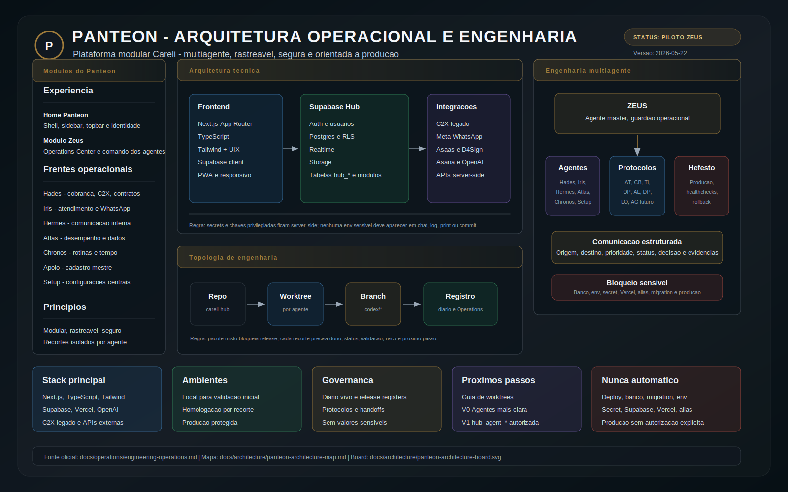
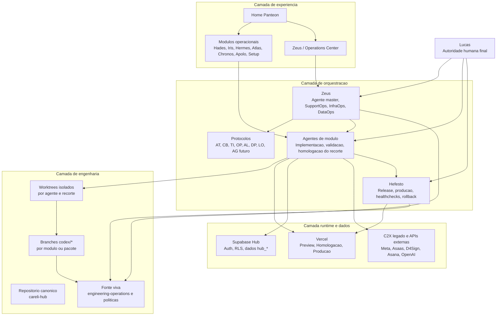
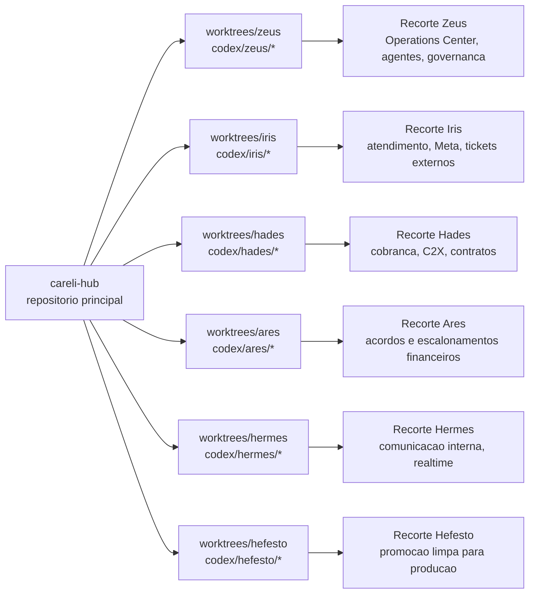
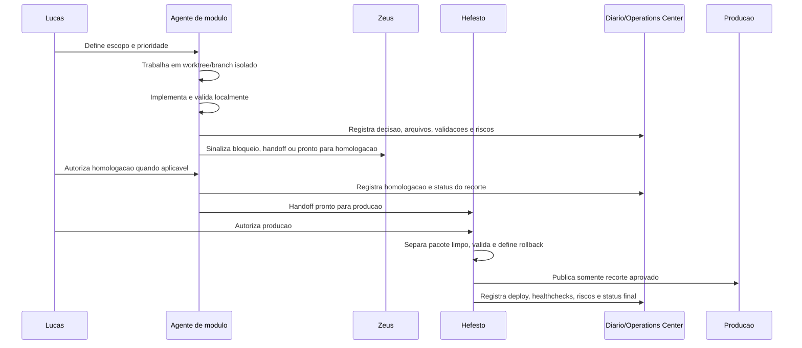

# Panteon - Mapa Executivo de Arquitetura

Status: `REFERENCIA EXECUTIVA / ZEUS PILOTO`
Owner: `Zeus`
Fonte viva complementar: `docs/operations/engineering-operations.md`

Este documento resume a arquitetura operacional e de engenharia do Panteon em
um mapa unico para orientar Lucas, Zeus, Hefesto e agentes de modulo.

Ele nao substitui os documentos de governanca. Ele organiza a leitura
executiva do sistema, dos agentes, dos worktrees, dos ambientes e do fluxo de
release.

Artefato visual complementar:

- `docs/architecture/panteon-architecture-board.svg`: board executivo
  versionado para apresentacao, revisao e exportacao.

## Objetivo executivo

O Panteon deve operar como uma plataforma modular, rastreavel e segura para a
operacao real da Careli.

A nova engenharia separa quatro responsabilidades:

- Produto: modulos operacionais como Hades, Iris, Hermes, Atlas, Chronos,
  Setup, Apolo e Zeus.
- Orquestracao: Zeus organiza sinais, bloqueios, handoffs, incidentes e
  comunicacao entre agentes.
- Release: Hefesto promove producao somente a partir de recortes homologados,
  validados e autorizados.
- Governanca: documentos, protocolos, worktrees, validacoes e registros
  estruturados preservam continuidade e reduzem risco.

## Visao de alto nivel

## Camadas da arquitetura

| Camada | Responsabilidade | Dono operacional | Regra-chave |
| --- | --- | --- | --- |
| Experiencia Panteon | Home, shell, topbar, sidebar, identidade visual e entrada dos modulos | Panteon Core / agentes de modulo | Seguir Home e design guidelines como contrato visual. |
| Modulos operacionais | Hades, Iris, Hermes, Atlas, Chronos, Apolo, Setup e Zeus | Agente do modulo | Nao misturar recortes nem alterar outro modulo sem pedido explicito. |
| Zeus / Operations Center | Registros, filas, bloqueios, comunicacao entre agentes, SupportOps, InfraOps e DataOps | Zeus | Coordenar trafego; nao substituir dono do modulo. |
| Release e producao | Promocao para producao, healthchecks, rollback e rastreabilidade oficial | Hefesto | Publicar somente recorte homologado, validado e autorizado. |
| Dados e integracoes | Supabase Hub, C2X legado, Meta, Asaas, D4Sign, Asana, OpenAI e outros provedores | Zeus + modulo dono | Qualquer secret, banco, env, migration ou API sensivel inicia `BLOQUEADO`. |
| Governanca | Diario, politicas, protocolos, release registers e scripts de retomada | Zeus / Hefesto conforme contexto | Repositorio e documentos sao fonte oficial, nao chat antigo. |

## Topologia de worktrees

O novo padrao evita que o worktree principal vire um pacote misto e
impublicavel. Cada frente relevante deve ter um worktree e branch proprios.

### Regras de worktree

- Um worktree deve representar um agente, modulo ou pacote operacional claro.
- Branches devem usar prefixo `codex/` e nome pesquisavel por agente/tema.
- O agente deve iniciar com `git status --short --branch`.
- Worktree sujo ou pacote misto bloqueia deploy geral.
- Recortes sensiveis devem ser separados antes de homologacao ou producao.
- O diario deve registrar worktree, branch, arquivos, validacoes, riscos e
  proximo passo quando a mudanca cria continuidade.

## Fluxo operacional padrao

## Papeis executivos

| Papel | Atua quando | Pode fazer | Deve bloquear |
| --- | --- | --- | --- |
| Lucas | Prioridade, aprovacao e decisao macro | Autorizar escopo, homologacao, producao e operacoes sensiveis | Qualquer risco que nao esteja claro. |
| Zeus | Coordenacao, incidentes, ambientes, banco, APIs, agents, suporte e dados | Diagnosticar, orientar, organizar handoffs, registrar riscos e evoluir Operations Center | Banco real, env, secret, migration, Vercel, alias, dominio e producao sem autorizacao. |
| Hefesto | Promocao para producao e rollback | Publicar recorte limpo homologado, fazer healthcheck e registrar producao | Worktree misto, recorte sem homologacao, env/migration pendente ou risco nao validado. |
| Agente de modulo | Evolucao funcional/visual do proprio modulo | Implementar, validar e publicar homologacao do proprio recorte quando autorizado | Alterar outro modulo, producao, banco ou env fora do escopo. |

## Ambientes e gates

| Ambiente | Uso | Gate |
| --- | --- | --- |
| Local | Desenvolvimento e validacao inicial | Sem secrets expostos; validacao tecnica proporcional ao risco. |
| Homologacao | Validacao operacional antes de producao | Autorizacao do Lucas para publicar recorte; sem mistura de modulo. |
| Producao | Operacao real Careli | Somente Hefesto ou autorizacao explicita; healthcheck e rollback obrigatorios. |

Operacoes que envolvam Supabase, Vercel, banco, dominio, alias, env, secret,
service role, `POSTGRES_URL`, migration, APIs externas ou producao iniciam como
`BLOQUEADO`.

## Fonte oficial de verdade

| Fonte | Funcao |
| --- | --- |
| `docs/operations/engineering-operations.md` | Diario canonico e append-only de decisoes, deploys, riscos e continuidade. |
| `docs/operations/releases-homologation.md` | Indice de recortes homologados, em homologacao ou prontos para producao. |
| `docs/operations/releases-production.md` | Indice de producao, bloqueios, rollback e rastreabilidade oficial. |
| `docs/operations/panteon-agent-communication-protocol.md` | Contrato de comunicacao entre agentes. |
| `docs/operations/panteon-agent-messaging-v1-design.md` | Desenho revisavel da V1 `hub_agent_*`, sem migration aplicada. |
| `docs/operations/panteon-engineering-evolution-roadmap.md` | Roadmap por fases para evoluir engenharia, Zeus, Hefesto, worktrees e V1 de agentes. |
| `docs/operations/panteon-agent-worktree-startup-template.md` | Template para abrir novos chats/agentes em worktrees separados sem depender de historico antigo. |
| `docs/operations/panteon-agent-scaffolds.md` | Scaffolds operacionais por agente, worktree, branch, escopo e bloqueios. |
| `docs/operations/panteon-worktree-operating-model.md` | Procedimento oficial para worktrees separados por agente, branches, validacoes e bloqueios de pacote misto. |
| `docs/operations/panteon-validation-checklists.md` | Gates de validacao por tipo de recorte. |
| `docs/operations/panteon-git-hooks.md` | Hooks Git locais para pre-commit, commit-msg e pre-push. |
| `scripts/panteon-new-worktree.ps1` | Preview seguro para scaffold de worktree e branch por agente. |
| `scripts/panteon-scaffold-agents.ps1` | Preview dos scaffolds padrao de todos os agentes. |
| `docs/architecture/agent-operating-model.md` | Modelo de atuacao, papeis e bloqueios obrigatorios. |
| `docs/architecture/security-governance.md` | Governanca de seguranca e operacoes sensiveis. |
| `docs/architecture/environment-governance.md` | Ambientes e env registry sem valores. |
| `docs/architecture/api-connection-governance.md` | Mapa seguro de APIs, conectores e bancos. |
| `docs/architecture/release-and-rollback-policy.md` | Release, healthchecks e rollback. |

## Estado atual da evolucao Zeus

- V0: aba `Agentes` no Zeus usando registros reais existentes.
- V0: comunicacao entre agentes derivada de diario estruturado e
  `hub_engineering_operation_records`.
- V0: sem tabela nova, sem migration, sem API mutavel e sem escrita real.
- V1 proposta: tabelas `hub_agent_*`, protocolo `AG-000001` e desenho
  tecnico revisavel em `docs/operations/panteon-agent-messaging-v1-design.md`.
- V1 bloqueada: depende de autorizacao explicita do Lucas antes de migration,
  API mutavel, escrita real ou deploy.

## Principios de engenharia

1. Repositorio e documentos sao continuidade oficial; chat antigo e contexto
   auxiliar, nao fonte de verdade.
2. Cada recorte deve ter dono, branch, worktree, validacao, risco e status.
3. Homologacao e por modulo; producao e por recorte limpo.
4. Zeus coordena, mas nao atropela agentes de modulo.
5. Hefesto publica producao, mas nao transforma worktree misto em release.
6. Secrets nunca entram em chat, logs, docs ou commits.
7. O sistema deve preservar o que ja esta em producao antes de evoluir o novo.

## Proximo nivel recomendado

- Formalizar um guia curto de criacao de worktree por agente.
- Evoluir a aba `Agentes` para evidenciar fila por destino, bloqueios,
  decisoes esperadas e handoff para Hefesto.
- Revisar o desenho tecnico da V1 `hub_agent_*` como proposta revisavel,
  ainda sem aplicar migration.
- Usar os checklists de validacao por tipo de recorte para frontend, API,
  banco, integracao externa, homologacao e producao.
- Usar hooks locais do Panteon como guardrails antes de commit e push.

## Conclusao executiva

O Panteon passa a ser operado como plataforma modular com engenharia
distribuida, governanca central e release protegido.

O ganho pratico e reduzir mistura de escopo, perda de contexto e risco de
producao, mantendo velocidade com worktrees por agente e rastreabilidade pelo
Zeus/Operations Center.
