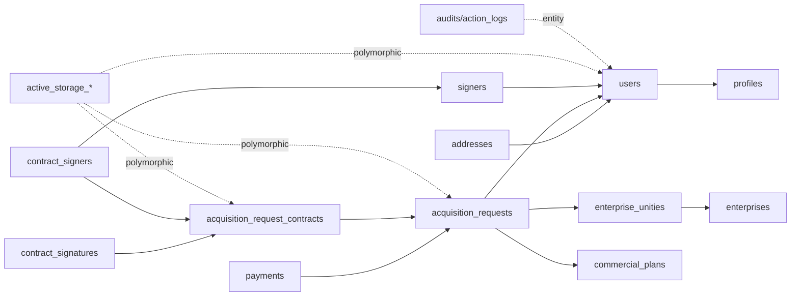

# C2X Legado - referencia operacional do banco

Atualizado em: 2026-05-22 11:20 -03:00

Responsavel pelo estudo: Athena / engenharia Careli Hub.

Status: estudo read-only concluido para servir como referencia operacional inicial do C2X Legado.

## Escopo e seguranca

- Fonte analisada: banco MySQL legado `prod_careli`, acessado com autorizacao explicita do Lucas.
- Tipo de acesso: leitura tecnica e metadados; nenhuma escrita, migration, deploy, env, secret ou valor sensivel foi alterado.
- Dados expostos neste documento: somente nomes de tabelas, relacionamentos, contagens agregadas, status de dominio e regras operacionais.
- Dados nao expostos: chaves, tokens, senhas, CPFs, CNPJs, e-mails, telefones, nomes de clientes finais em massa, textos completos de contrato ou payloads sensiveis.
- Uso recomendado: referencia para Apolo, Hades, Iris, dashboards executivos e investigacoes controladas do legado.

## Resumo executivo

- O C2X Legado e um banco Rails-like, com `active_storage_*`, `audits`, `schema_migrations`, `datetime(6)` e dominio fortemente normalizado.
- `users` e a tabela mestre de pessoas, empresas e usuarios do ecossistema legado. Ela nao representa apenas login.
- `acquisition_requests` concentra propostas, reservas, venda, contrato, faturamento e participantes comerciais.
- `payments` e a fonte operacional de financeiro, carteira, inadimplencia, recuperacao e comportamento de pagamento.
- `enterprise_unities` representa unidades/lotes, ligada a `enterprises` e ao status comercial da unidade.
- Contratos e assinaturas ficam em `acquisition_request_contracts`, `contract_signatures`, `contract_signers`, `contract_signature_signers` e `signers`.
- Anexos usam duas camadas: `attachments` propria e `active_storage_*` polimorfica.
- Para dashboards, a regra central e cruzar pessoa -> proposta -> unidade/empreendimento -> pagamentos, preservando os status reais do legado.

## Inventario validado

| Item | Valor |
| --- | ---: |
| Banco | `prod_careli` |
| Tabelas | 127 |
| Colunas | 1.079 |
| Foreign keys declaradas | 155 |
| Linhas aproximadas no banco | 245.244 |
| Dados aproximados | 2.034,84 MB |
| Indices aproximados | 58,64 MB |

### Contagens exatas dos objetos centrais

| Tabela | Linhas |
| --- | ---: |
| `payments` | 128.604 |
| `contract_signers` | 18.971 |
| `active_storage_blobs` | 11.739 |
| `active_storage_attachments` | 11.421 |
| `acquisition_request_historics` | 9.419 |
| `audits` | 8.843 |
| `attachments` | 7.908 |
| `addresses` | 5.839 |
| `signers` | 5.117 |
| `acquisition_requests` | 4.069 |
| `enterprise_unities` | 4.056 |
| `users` | 3.928 |
| `contract_signatures` | 3.246 |
| `commercial_plans` | 2.900 |
| `acquisition_request_contracts` | 2.654 |
| `action_logs` | 2.735 |

Observacao operacional: `acquisition_request_contracts` e muito grande por armazenar textos completos de contrato. Dashboards e telas operacionais nao devem selecionar `complete_text`/campos equivalentes sem necessidade explicita.

## Tabelas por dominio

### Pessoas, perfis e cadastro civil

`users`, `profiles`, `person_types`, `user_statuses`, `user_incorporador_profiles`, `civil_states`, `sexes`, `property_regimes`, `schoolings`, `professions`, `salary_ranges`, `company_sizes`, `document_types`, `legal_representatives`, `spouses`, `cpf_validations`, `count_users`, `incorporadores_users`, `coordenadores_users`, `imobiliarias_users`, `corretores_enterprises`, `enterprises_users`, `enterprise_unities_users`.

### Contato, endereco e localidade

`addresses`, `address_areas`, `address_types`, `countries`, `states`, `cities`, `phones`, `phone_types`, `mobiles`, `mobile_types`, `emails`, `email_types`, `site_contacts`, `site_contact_subjects`, `newsletters`, `topic_subscriptions`.

### Empreendimentos, unidades e politica comercial

`enterprises`, `enterprise_types`, `enterprise_tables`, `enterprise_unities`, `enterprise_unity_types`, `enterprise_sale_status_colors`, `sale_statuses`, `enterprises_imobiliarias`, `commercial_policies`, `credit_analysis_impediments`, `due_days`, `property_regimes`.

### Propostas, aquisicoes, contrato e assinatura

`acquisition_requests`, `acquisition_request_stages`, `acquisition_request_types`, `acquisition_request_historics`, `acquisition_requests_corretores`, `acquisition_requests_imobiliarias`, `commercial_plans`, `commercial_plan_people`, `commercial_plan_values`, `signal_commercial_plans`, `draft_contracts`, `acquisition_request_contracts`, `acquisition_request_contract_statuses`, `contract_signatures`, `contract_signature_statuses`, `contract_signature_types`, `contract_signature_signers`, `contract_signers`, `signers`, `contract_adjustment_schedules`.

### Financeiro, pagamentos, split, pedidos e assinaturas comerciais

`payments`, `payment_statuses`, `payment_types`, `payment_transactions`, `parcel_types`, `asaas_integrations`, `asaas_master_accounts`, `banks`, `data_banks`, `data_bank_types`, `split_enterprises`, `split_enterprise_groups`, `split_enterprise_group_values`, `split_group_names`, `split_profiles`, `orders`, `order_carts`, `order_statuses`, `discount_coupons`, `discount_coupon_types`, `discount_coupon_areas`, `discount_coupon_areas_coupons`, `subscriptions`, `subscription_statuses`.

### Produto, planos, conteudo e site

`categories`, `category_types`, `sub_categories`, `products`, `services`, `plans`, `plan_services`, `plan_periodicities`, `data_plan_periodicities`, `banners`, `banner_areas`, `cards`, `card_banners`, `faqs`, `testimonies`, `rooms`, `messages`, `onesignal_segments`, `schoolings`.

### Arquivos, auditoria e infraestrutura da aplicacao

`attachments`, `active_storage_attachments`, `active_storage_blobs`, `active_storage_variant_records`, `ckeditor_assets`, `audits`, `action_logs`, `csv_exports`, `api_keys`, `system_configurations`, `schema_migrations`, `ar_internal_metadata`.

## Dicionarios e status principais

### Perfis em `profiles`

| ID | Nome |
| ---: | --- |
| 1 | Administrador |
| 2 | Cliente |
| 3 | Incorporador |
| 4 | Usuario de acesso incorporador |
| 5 | Coordenadora de venda |
| 6 | Imobiliaria |
| 7 | Corretor |

### Tipo de pessoa

| ID | Nome |
| ---: | --- |
| 1 | Fisica |
| 2 | Juridica |

### Status do usuario

| ID | Nome |
| ---: | --- |
| 1 | Aguardando aprovacao |
| 2 | Aprovado |
| 3 | Reprovado |

### Status de venda da unidade

| ID | Nome |
| ---: | --- |
| 1 | Disponivel |
| 2 | Reservado |
| 3 | Em negociacao |
| 4 | Vendido |
| 5 | Bloqueado para venda |

### Estagios de `acquisition_requests`

| ID | Nome |
| ---: | --- |
| 1 | Reservado |
| 2 | Analise de credito |
| 3 | Contrato gerado |
| 4 | Faturado |
| 5 | Em assinatura |
| 6 | Finalizado |
| 7 | Cancelado |
| 8 | Reprovado analise de credito |
| 9 | Proposta realizada |
| 10 | Em distrato |
| 11 | Distratado |

### Status de pagamento

| ID | Nome |
| ---: | --- |
| 1 | Cancelado |
| 2 | Estornado |
| 3 | Nao autorizado |
| 4 | Nao pago |
| 5 | Pago |
| 6 | Aguardando pagamento |
| 7 | Atrasado |

### Tipo de pagamento

| ID | Nome |
| ---: | --- |
| 1 | Cartao de credito |
| 2 | Boleto |
| 3 | PIX |

### Tipo de parcela

| ID | Leitura operacional |
| ---: | --- |
| 1 | Ato |
| 2 | Sinal |
| 3 | Parcela |
| 4 | Avulso |

## Distribuicoes operacionais observadas

### Usuarios por perfil

| Perfil | Quantidade |
| --- | ---: |
| Cliente | 3.432 |
| Imobiliaria | 374 |
| Administrador | 68 |
| Corretor | 24 |
| Incorporador | 21 |
| Coordenadora de venda | 5 |
| Usuario de acesso incorporador | 4 |

### Usuarios por tipo de pessoa

| Tipo | Quantidade |
| --- | ---: |
| Fisica | 3.449 |
| Juridica | 479 |

### Pagamentos por status

| Status | Quantidade |
| --- | ---: |
| Aguardando pagamento | 107.250 |
| Pago | 13.223 |
| Atrasado | 8.131 |

### Propostas por estagio

| Estagio | Quantidade |
| --- | ---: |
| Cancelado | 1.801 |
| Faturado | 1.776 |
| Em assinatura | 409 |
| Reservado | 59 |
| Distratado | 14 |
| Contrato gerado | 6 |
| Proposta realizada | 3 |
| Em distrato | 1 |

### Unidades por status de venda

| Status | Quantidade |
| --- | ---: |
| Disponivel | 1.803 |
| Vendido | 1.776 |
| Em negociacao | 418 |
| Reservado | 59 |

## Relacionamentos centrais



### Regra de leitura para pessoa 360

1. Identidade e perfil: `users -> profiles/person_types/user_statuses`.
2. Endereco/contato: `addresses`, `phones`, `mobiles`, `emails` e campos diretos de `users`.
3. Participacao comercial: `acquisition_requests.client_id`, `client_2_id`, `client_3_id`, `client_4_id`, `client_5_id`, tabelas auxiliares de corretores/imobiliarias e vinculos por perfil.
4. Unidade e empreendimento: `acquisition_requests.enterprise_unity_id -> enterprise_unities.enterprise_id -> enterprises`.
5. Financeiro: `payments.acquisition_request_id -> acquisition_requests.id`.
6. Contrato: `acquisition_request_contracts -> contract_signatures/contract_signers/signers`.
7. Evidencias/documentos: `attachments` e `active_storage_*`, considerando associacoes polimorficas.
8. Auditoria: `audits` e `action_logs`, evitando expor payloads sensiveis sem filtro.

## Fluxo real de proposta, contrato, pagamento e distrato

Contexto operacional registrado pelo Lucas em 2026-05-22:

- `acquisition_requests` organiza o ciclo da proposta. Uma mesma unidade pode ter varias propostas ao longo do tempo.
- Uma proposta pode ser criada para a unidade `Y` e cliente `A`, nao seguir adiante, ser cancelada e deixar a unidade novamente disponivel para venda.
- Apos cancelamento de uma proposta, a unidade pode receber nova proposta para outro cliente. Esse historico e relevante e nao deve ser descartado em analises comerciais.
- Quando a proposta avanca, vira contrato; apos assinatura e faturamento, sao geradas parcelas em `payments`.
- `payments` representa pagamentos/parcelas geradas para uma aquisicao, cliente/unidade e contrato. Ela e forte para analise financeira, mas nao significa sozinha que a venda continua ativa hoje.
- Durante o periodo de pagamento, o cliente pode cancelar ou entrar em distrato. O que ja foi pago permanece como historico financeiro.
- A mesma unidade pode voltar a ser vendida posteriormente e gerar novos pagamentos para outro cliente. Logo, uma unidade pode ter pagamentos vinculados a mais de um cliente em momentos diferentes.
- Casos com `payments` ativo e `acquisition_requests` em `Cancelado` nao devem ser tratados automaticamente como erro: podem representar historico financeiro preservado, cancelamento posterior, distrato ou venda reprocessada.
- Para entender a dinamica correta de mudanca de etapa, sempre consultar tambem `acquisition_request_historics`.

Regra de leitura:

- Analise comercial de funil/proposta: partir de `acquisition_requests` e cruzar com `acquisition_request_historics`.
- Analise financeira/carteira/parcelas: partir de `payments`, mantendo o vinculo com `acquisition_requests`, `users`, `enterprise_unities` e `enterprises`.
- Analise de comprador atual da unidade: nao assumir apenas `payments` nem apenas stage atual; deve considerar historico, status da unidade, stage da aquisicao, contrato, pagamento e possivel distrato.
- Analise de historico da unidade: permitir multiplos clientes por unidade ao longo do tempo, separando tentativa, venda faturada, cancelamento, distrato e nova venda.
- Regra V1 para comprador atual validada em 2026-05-22: ordenar `acquisition_requests` por unidade usando `created_at` e `id`; a unidade so entra como comprador atual quando a ultima requisicao daquela unidade estiver em `Faturado` ou `Finalizado`. Requisicoes anteriores canceladas permanecem como historico, mas nao removem a venda atual se houve nova proposta posterior faturada/finalizada.

## Matriz de foreign keys declaradas

```text
acquisition_request_contracts.acquisition_request_contract_status_id -> acquisition_request_contract_statuses.id
acquisition_request_contracts.acquisition_request_id -> acquisition_requests.id
acquisition_request_contracts.draft_contract_id -> draft_contracts.id
acquisition_request_historics.acquisition_request_id -> acquisition_requests.id
acquisition_request_historics.user_id -> users.id
acquisition_requests.acquisition_request_stage_id -> acquisition_request_stages.id
acquisition_requests.acquisition_request_type_id -> acquisition_request_types.id
acquisition_requests.client_2_id -> users.id
acquisition_requests.client_3_id -> users.id
acquisition_requests.client_4_id -> users.id
acquisition_requests.client_5_id -> users.id
acquisition_requests.commercial_plan_id -> commercial_plans.id
acquisition_requests.draft_contract_id -> draft_contracts.id
acquisition_requests.due_day_id -> due_days.id
acquisition_requests.enterprise_unity_id -> enterprise_unities.id
acquisition_requests.last_updated_by_id -> users.id
acquisition_requests.registered_by_id -> users.id
acquisition_requests_corretores.acquisition_request_id -> acquisition_requests.id
acquisition_requests_imobiliarias.acquisition_request_id -> acquisition_requests.id
action_logs.user_id -> users.id
active_storage_attachments.blob_id -> active_storage_blobs.id
addresses.address_area_id -> address_areas.id
addresses.address_type_id -> address_types.id
addresses.city_id -> cities.id
addresses.country_id -> countries.id
addresses.state_id -> states.id
asaas_integrations.asaas_master_account_id -> asaas_master_accounts.id
asaas_integrations.user_id -> users.id
attachments.enterprise_unity_type_id -> enterprise_unity_types.id
banners.banner_area_id -> banner_areas.id
cards.card_banner_id -> card_banners.id
categories.category_type_id -> category_types.id
cities.country_id -> countries.id
cities.state_id -> states.id
commercial_plan_values.commercial_plan_id -> commercial_plans.id
commercial_plan_values.commercial_plan_person_id -> commercial_plan_people.id
commercial_plan_values.index_monetary_correction_id -> index_monetary_corrections.id
commercial_plans.acquisition_request_id -> acquisition_requests.id
commercial_plans.draft_contract_id -> draft_contracts.id
commercial_plans.enterprise_id -> enterprises.id
commercial_plans.index_monetary_correction_id -> index_monetary_corrections.id
commercial_plans.last_updated_by_id -> users.id
commercial_plans.registered_by_id -> users.id
commercial_policies.enterprise_id -> enterprises.id
contract_adjustment_schedules.acquisition_request_id -> acquisition_requests.id
contract_adjustment_schedules.index_monetary_correction_id -> index_monetary_corrections.id
contract_signature_signers.contract_signature_id -> contract_signatures.id
contract_signature_signers.contract_signature_type_id -> contract_signature_types.id
contract_signature_signers.contract_signer_id -> contract_signers.id
contract_signatures.acquisition_request_contract_id -> acquisition_request_contracts.id
contract_signatures.contract_signature_status_id -> contract_signature_statuses.id
contract_signatures.last_updated_by_id -> users.id
contract_signatures.registered_by_id -> users.id
contract_signers.acquisition_request_contract_id -> acquisition_request_contracts.id
contract_signers.contract_signature_type_id -> contract_signature_types.id
contract_signers.signer_id -> signers.id
corretores_enterprises.enterprise_id -> enterprises.id
count_users.profile_id -> profiles.id
cpf_validations.user_id -> users.id
cpf_validations.validated_user_id -> users.id
credit_analysis_impediments.commercial_policy_id -> commercial_policies.id
csv_exports.user_id -> users.id
data_banks.bank_id -> banks.id
data_banks.data_bank_type_id -> data_bank_types.id
data_plan_periodicities.plan_id -> plans.id
data_plan_periodicities.plan_periodicity_id -> plan_periodicities.id
discount_coupons.discount_coupon_type_id -> discount_coupon_types.id
draft_contracts.enterprise_id -> enterprises.id
draft_contracts.enterprise_unity_type_id -> enterprise_unity_types.id
draft_contracts.last_updated_by_id -> users.id
draft_contracts.registered_by_id -> users.id
due_days.commercial_policy_id -> commercial_policies.id
emails.email_type_id -> email_types.id
enterprise_sale_status_colors.enterprise_id -> enterprises.id
enterprise_sale_status_colors.sale_status_id -> sale_statuses.id
enterprise_unities.enterprise_id -> enterprises.id
enterprise_unities.enterprise_unity_type_id -> enterprise_unity_types.id
enterprise_unities.last_updated_by_id -> users.id
enterprise_unities.registered_by_id -> users.id
enterprise_unities.sale_status_id -> sale_statuses.id
enterprises.asaas_master_account_id -> asaas_master_accounts.id
enterprises.city_id -> cities.id
enterprises.draft_contract_digital_proposal_id -> draft_contracts.id
enterprises.enterprise_table_id -> enterprise_tables.id
enterprises.enterprise_type_id -> enterprise_types.id
enterprises.last_updated_by_id -> users.id
enterprises.normal_plan_2_id -> commercial_plans.id
enterprises.registered_by_id -> users.id
enterprises_imobiliarias.enterprise_id -> enterprises.id
index_monetary_correction_values.index_monetary_correction_id -> index_monetary_corrections.id
index_monetary_correction_values.last_updated_by_id -> users.id
index_monetary_correction_values.registered_by_id -> users.id
index_monetary_corrections.last_updated_by_id -> users.id
index_monetary_corrections.plan_periodicity_id -> plan_periodicities.id
index_monetary_corrections.registered_by_id -> users.id
legal_representatives.civil_state_id -> civil_states.id
legal_representatives.document_type_id -> document_types.id
mobiles.mobile_type_id -> mobile_types.id
mobiles.user_id -> users.id
order_carts.order_id -> orders.id
orders.discount_coupon_id -> discount_coupons.id
orders.order_status_id -> order_statuses.id
orders.payment_type_id -> payment_types.id
orders.user_id -> users.id
payment_transactions.payment_status_id -> payment_statuses.id
payments.acquisition_request_id -> acquisition_requests.id
payments.last_updated_by_id -> users.id
payments.parcel_type_id -> parcel_types.id
payments.payment_status_id -> payment_statuses.id
payments.payment_type_id -> payment_types.id
payments.registered_by_id -> users.id
phones.phone_type_id -> phone_types.id
plan_services.plan_id -> plans.id
plans.category_id -> categories.id
plans.sub_category_id -> sub_categories.id
products.category_id -> categories.id
products.sub_category_id -> sub_categories.id
services.category_id -> categories.id
signal_commercial_plans.commercial_plan_id -> commercial_plans.id
signers.document_type_id -> document_types.id
signers.user_id -> users.id
site_contacts.site_contact_subject_id -> site_contact_subjects.id
site_contacts.user_id -> users.id
split_enterprise_group_values.split_enterprise_group_id -> split_enterprise_groups.id
split_enterprise_group_values.split_profile_id -> split_profiles.id
split_enterprise_group_values.user_id -> users.id
split_enterprise_groups.split_enterprise_id -> split_enterprises.id
split_enterprise_groups.split_group_name_id -> split_group_names.id
split_enterprises.enterprise_id -> enterprises.id
split_enterprises.last_updated_by_id -> users.id
split_enterprises.registered_by_id -> users.id
spouses.document_type_id -> document_types.id
spouses.profession_id -> professions.id
spouses.sex_id -> sexes.id
states.country_id -> countries.id
sub_categories.category_id -> categories.id
subscriptions.data_plan_periodicity_id -> data_plan_periodicities.id
subscriptions.subscription_status_id -> subscription_statuses.id
subscriptions.user_id -> users.id
testimonies.city_id -> cities.id
testimonies.state_id -> states.id
users.civil_state_id -> civil_states.id
users.company_size_id -> company_sizes.id
users.document_type_id -> document_types.id
users.payment_type_id -> payment_types.id
users.person_type_id -> person_types.id
users.profession_id -> professions.id
users.profile_id -> profiles.id
users.property_regime_id -> property_regimes.id
users.salary_range_id -> salary_ranges.id
users.schooling_id -> schoolings.id
users.sex_id -> sexes.id
users.user_incorporador_profile_id -> user_incorporador_profiles.id
users.user_status_id -> user_statuses.id
users.who_registered_id -> users.id
```

## Integridade observada em pontos criticos

| Relacao validada | Resultado |
| --- | --- |
| `acquisition_requests.client_id` com `users.id` | 4.069 de 4.069 vinculados, embora nao apareca como FK declarada |
| `acquisition_requests.enterprise_unity_id` com `enterprise_unities.id` | 4.069 de 4.069 vinculados |
| `payments.acquisition_request_id` com `acquisition_requests.id` | 128.604 de 128.604 vinculados |
| `acquisition_requests.corretor_id` | Campo existe, mas estava vazio na leitura atual |
| `users.vinculed_by_id` | 3.431 vinculados e 1 referencia ausente observada |

## Carteira financeira agregada

Filtro usado para leitura operacional inicial:

```sql
payments.payment_status_id in (5, 6, 7)
and (payments.payment_to_delete is null or payments.payment_to_delete = 0)
```

Resultado agregado:

| Indicador | Valor |
| --- | ---: |
| Pagamentos ativos | 128.601 |
| Propostas com pagamento ativo | 994 |
| Unidades com pagamento ativo | 990 |
| Clientes principais | 784 |
| Compradores participantes, considerando `client_id` ate `client_5_id` | 803 |
| Carteira | R$ 82.148.045,35 |
| Pago | R$ 13.514.108,55 |
| Pendente | R$ 60.556.467,64 |
| Atrasado | R$ 7.315.741,46 |

### Top empreendimentos por carteira ativa

| Sigla | Empreendimento | Carteira | Atrasado |
| --- | --- | ---: | ---: |
| LOS | LAVRA DO OURO | R$ 20.599.969,76 | R$ 392.592,34 |
| LOU | LAVRA DO OURO | R$ 14.569.612,94 | R$ 521.974,30 |
| PDV | PORTAL DOS VALES | R$ 11.919.950,57 | R$ 3.147.177,21 |
| PVS | PORTAL DOS VALES | R$ 8.431.425,22 | R$ 2.118.475,21 |
| LBF | LAGOA BONITA | R$ 7.741.938,88 | R$ 87.477,70 |
| REP | RECANTO DO PARA | R$ 6.397.447,84 | R$ 87.234,85 |
| MDS | MORADA DA SERRA | R$ 3.386.712,34 | R$ 95.195,30 |
| VAL | VISTA ALEGRE | R$ 2.984.593,16 | R$ 29.040,00 |
| VDP | VISTAS DA PRAIA | R$ 2.629.277,32 | R$ 16.365,14 |
| LBR | LAGOA BONITA | R$ 2.252.473,90 | R$ 562.330,87 |

Observacao: empreendimentos de treinamento/teste, como `SDT` ou equivalentes, devem ficar fora dos dashboards executivos salvo pedido explicito do Lucas.

## Regras operacionais para dashboards

- Cliente/comprador nao deve ser inferido somente por `users.profile_id = 2`; o papel comercial deve nascer do cruzamento entre participante da proposta, unidade, contrato, pagamento e historico.
- Para "comprou unidade", separar o conceito:
  - comprador financeiro: participante de aquisicao com parcelas/pagamentos gerados em `payments`;
  - comprador atual/ativo: exige regra adicional de status da aquisicao, status da unidade, contrato e possivel distrato;
  - historico comercial da unidade: deve incluir propostas canceladas, novas propostas, faturamento, cancelamento posterior e revenda.
- Para comprador atual V1, usar a ultima `acquisition_requests` da unidade. Se a ultima requisicao estiver em `Faturado` ou `Finalizado`, os participantes `client_id`, `client_2_id`, `client_3_id`, `client_4_id` e `client_5_id` sao compradores atuais. Se a ultima requisicao estiver em `Cancelado`, `Reservado`, `Em assinatura`, `Contrato gerado` ou `Proposta realizada`, a unidade nao entra como comprador atual.
- Comparativo de 2026-05-22: `acquisition_requests` faturadas/finalizadas somam 1.776 aquisicoes, mas apenas 944 delas possuem pagamento ativo. A tabela `payments` possui 994 aquisicoes com pagamento ativo: 944 em `Faturado` e 50 em `Cancelado`. Esses 50 casos nao devem ser classificados automaticamente como erro; podem ser historico financeiro preservado, distrato/cancelamento posterior ou revenda. Dashboards devem expor `status_aquisicao` e consultar `acquisition_request_historics` antes de decidir a classificacao final.
- Export V1 de comprador atual em 2026-05-22: 2.414 unidades com requisicao; 1.776 unidades com ultima requisicao em `Faturado`; 638 unidades sem comprador atual pela regra; 1.817 linhas de compradores atuais por causa de participantes adicionais; 699 unidades compradoras atuais tiveram cancelamentos historicos anteriores, o que confirma a importancia de preservar o historico.
- Comparativo Legado x CX em 2026-05-22: para identificar compradores atuais ausentes na plataforma de atendimento, usar compradores atuais pela ultima requisicao da unidade, normalizar CPF/CNPJ e telefone, bater primeiro por CPF/CNPJ e somente o saldo por telefone/WhatsApp. Resultado operacional do primeiro arquivo: 1.459 compradores unicos no Legado, 1.319 encontrados por CPF/CNPJ na CX, 38 encontrados por telefone/WhatsApp e 102 nao encontrados na CX.
- Para "faturado", usar `acquisition_request_stage_id = 4`.
- Para inadimplencia, usar `payments.payment_status_id = 7` e vencimentos; para carteira ativa, considerar status 5, 6 e 7 com `payment_to_delete` desligado.
- Para "em aberto", separar pelo contexto:
  - financeiro: pagamentos aguardando ou atrasados;
  - proposta/contrato: stage da `acquisition_requests`;
  - atendimento: fonte Iris/CareDesk;
  - operacao interna: fonte Zeus/SquadOps.
- Para contratos, evitar carregar textos completos; preferir metadados de status, vinculo, assinatura e signatarios.
- Para documentos/anexos, respeitar a natureza polimorfica de `active_storage_attachments.record_type/record_id` e `attachments.ownertable_type/ownertable_id`.
- Para Apolo, manter C2X como origem rica e consultiva ate a virada oficial; novos cadastros no Apolo devem sincronizar com o legado somente com idempotencia, auditoria e aprovacao de arquitetura.
- Para Hades, preservar `payments` como fonte primaria de cobranca e comportamento financeiro.
- Para Iris, vincular historico de atendimento por contato, documento, telefone, e-mail, `c2x_user_id` e entidades relacionadas.

## Leituras recomendadas para proximos dashboards

### CRM 360 / Apolo

- Pessoas por perfil, tipo de pessoa, status e origem.
- Participantes por unidade, empreendimento, contrato e proposta.
- Timeline por pessoa: cadastro, proposta, pagamento, contrato, assinatura, atendimento, reuniao e protocolo.
- Qualidade cadastral: documento ausente, telefone/e-mail ausente, endereco incompleto, divergencia entre perfis.

### Comercial e carteira

- Unidades por empreendimento e status de venda.
- Propostas por estagio, empreendimento, periodo e responsavel.
- Faturados, cancelados, distratados e em assinatura.
- Ranking de empreendimentos por carteira, atraso, pendencia e volume de compradores.

### Financeiro / Hades

- Total de parcelas por status, tipo de parcela e tipo de pagamento.
- Valor pago, pendente, aguardando, atrasado e recuperado.
- Aging por dias de atraso.
- Compradores com maior risco financeiro.
- Comportamento por empreendimento/unidade.

### Contratos e documentos

- Contratos por status.
- Assinaturas por status e etapa.
- Signatarios por contrato.
- Gargalos de integracao externa de assinatura.
- Anexos por entidade, tipo e origem.

## Lacunas e proximas validacoes

- Validar nomes exatos de colunas usadas para campos contratuais obrigatorios no formulario Apolo.
- Mapear campos de `users` por perfil com obrigatoriedade real do legado.
- Validar regras de conjuge, representante legal, pessoa juridica e participantes secundarios.
- Conferir modelos polimorficos de anexos/documentos antes de criar area de documentos no Apolo.
- Separar claramente ambientes e empreendimentos de teste antes de dashboards executivos.
- Conferir se ha procedures/jobs legados que alteram `payments`, `acquisition_requests` ou status de assinatura fora do fluxo normal da aplicacao.
- Criar queries materializadas/read models somente apos escolher o primeiro dashboard.

## Conclusao tecnica

O C2X Legado esta suficientemente mapeado para iniciar dashboards executivos e o desenho do Apolo como CRM central. A modelagem deve respeitar a natureza historica do legado: `users` e pessoa/organizacao/perfil, `acquisition_requests` e ciclo comercial, `payments` e financeiro, `enterprise_unities` e unidade, e contratos/assinaturas/anexos formam camadas especializadas ao redor desses eixos.
