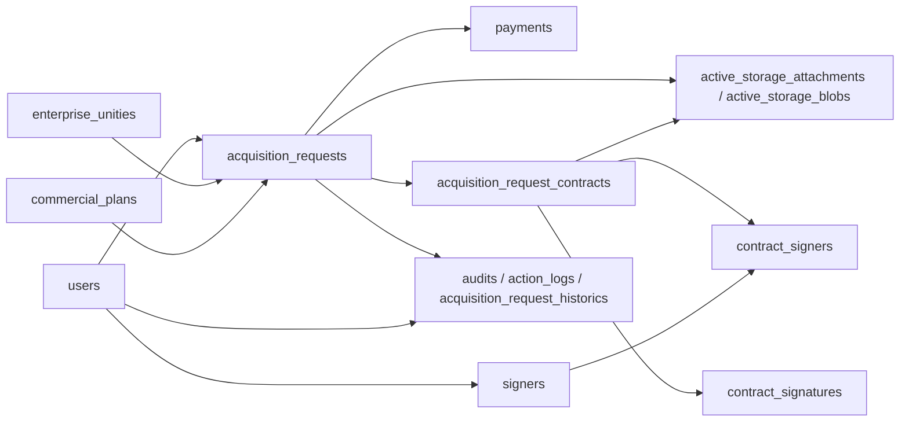

# Guardian Database Map

Atualizado em: 2026-05-14 17:29

Este mapa foi gerado a partir de metadados do banco `prod_careli`, sem exportar dados sensiveis de clientes, pagamentos ou contratos.

## Conexao

- Origem: RDS MySQL do Guardian.
- Banco: `prod_careli`.
- Status local: conectado via rota `/api/guardian/db/health`.
- Tempo do health check observado: 163 ms.

## Visao Geral

- Tabelas: 127.
- Colunas: 1.079.
- Foreign keys: 155.
- Padrao observado: aplicacao com forte indicio de origem Rails, incluindo `active_storage_*`, `audits`, `password_digest`, `datetime(6)` e tabelas de dominio normalizadas.

## Maiores Tabelas

| Tabela | Linhas aprox. | Dados | Indices | Leitura inicial |
| --- | ---: | ---: | ---: | --- |
| `payments` | 126.248 | 55 MB | 28 MB | Centro financeiro/cobrancas/parcelas. |
| `contract_signers` | 17.894 | 2 MB | 3 MB | Participantes vinculados a contratos para assinatura. |
| `contract_signature_signers` | 16.937 | 5 MB | 2 MB | Relacao de assinaturas e signatarios. |
| `active_storage_blobs` | 10.460 | 4 MB | 1 MB | Metadados de arquivos do Active Storage. |
| `active_storage_attachments` | 10.088 | 2 MB | 2 MB | Vinculos polimorficos de arquivos. |
| `attachments` | 7.431 | <1 MB | 1 MB | Camada propria de anexos por entidade. |
| `acquisition_request_historics` | 7.168 | 2 MB | 1 MB | Historico das propostas/solicitacoes. |
| `cities` | 5.664 | 2 MB | <1 MB | Cadastro geografico. |
| `addresses` | 5.590 | 2 MB | 1 MB | Enderecos. |
| `audits` | 5.033 | 17 MB | 1 MB | Auditoria de alteracoes. |
| `signers` | 4.751 | 2 MB | <1 MB | Pessoas signatarias. |
| `enterprise_unities` | 4.133 | <1 MB | 1 MB | Unidades/lotes/produtos imobiliarios. |
| `acquisition_requests` | 3.981 | 2 MB | 2 MB | Propostas/solicitacoes principais. |
| `users` | 3.778 | 3 MB | 2 MB | Usuarios, clientes, corretores e perfis relacionados. |
| `contract_signatures` | 3.059 | 2 MB | <1 MB | Processo/status de assinatura digital. |
| `commercial_plans` | 2.842 | <1 MB | 1 MB | Planos comerciais vinculados a empreendimentos/propostas. |
| `acquisition_request_contracts` | 2.612 | 1.911 MB | <1 MB | Contratos gerados; contem campos grandes de texto completo. |
| `asaas_integrations` | 2.195 | 1 MB | <1 MB | Integracoes com Asaas por usuario/conta mestre. |
| `action_logs` | 1.832 | <1 MB | <1 MB | Eventos de acao por entidade/usuario. |

## Fluxos Principais

### Propostas e Aquisicoes

Tabela central: `acquisition_requests`.

Campos importantes:

- `id`, `code`.
- `enterprise_unity_id`.
- `client_id`, `client_2_id`, `client_3_id`, `client_4_id`, `client_5_id`.
- `corretor_id`.
- `commercial_plan_id`.
- `draft_contract_id`.
- `acquisition_request_stage_id`.
- `acquisition_request_type_id`.
- `approval_status`.
- `billing_date`, `act_date`, `sign_date`.
- `annual_value`.
- `registered_by_id`, `last_updated_by_id`.

Relacionamentos principais:

- `enterprise_unity_id -> enterprise_unities.id`.
- `commercial_plan_id -> commercial_plans.id`.
- `draft_contract_id -> draft_contracts.id`.
- `acquisition_request_stage_id -> acquisition_request_stages.id`.
- `acquisition_request_type_id -> acquisition_request_types.id`.
- `registered_by_id -> users.id`.
- `last_updated_by_id -> users.id`.
- Clientes adicionais `client_2_id` ate `client_5_id -> users.id`.

Observacao: `client_id` e `corretor_id` aparecem como campos fortes do fluxo, mas na leitura de metadados nao retornaram como foreign keys declaradas. Precisamos validar por consulta de dados controlada antes de assumir joins.

### Pagamentos

Tabela central: `payments`.

Campos importantes:

- `acquisition_request_id`.
- `parcel_type_id`.
- `payment_type_id`.
- `payment_status_id`.
- `initial_value`, `interest_value`, `mulct_value`, `paid_value`.
- `due_date`, `payment_date`.
- `total_signal_parcels`, `total_parcels`.
- `current_signal_parcel`, `current_total_parcel`.
- `payment_asaas_id`, `payment_asaas_installment_id`.
- `payment_asaas_url`, `payment_asaas_invoice_url`.
- `split_data`.
- `description`.
- `asaas_error`.
- `escrow_id`, `escrow_status`, `escrow_expiration_date`, `escrow_finish_date`, `escrow_finish_reason`, `escrow_synced_at`.
- `registered_by_id`, `last_updated_by_id`.

Relacionamentos principais:

- `acquisition_request_id -> acquisition_requests.id`.
- `parcel_type_id -> parcel_types.id`.
- `payment_type_id -> payment_types.id`.
- `payment_status_id -> payment_statuses.id`.
- `registered_by_id -> users.id`.
- `last_updated_by_id -> users.id`.

Observacao: e a maior tabela do banco. Qualquer tela do Hub sobre financeiro/cobranca deve filtrar bem e paginar desde o inicio.

### Contratos e Assinaturas

Tabelas centrais:

- `acquisition_request_contracts`.
- `contract_signatures`.
- `contract_signers`.
- `signers`.

`acquisition_request_contracts`:

- `acquisition_request_id -> acquisition_requests.id`.
- `draft_contract_id -> draft_contracts.id`.
- `acquisition_request_contract_status_id -> acquisition_request_contract_statuses.id`.
- Contem `complete_text` e `complete_text_brokerage`, responsaveis pelo volume muito alto da tabela.

`contract_signatures`:

- `acquisition_request_contract_id -> acquisition_request_contracts.id`.
- `contract_signature_status_id -> contract_signature_statuses.id`.
- Campos de integracao externa: `uuidDoc`, `uuidSafe`, `uuidFolder`, `statusId`, `statusComment`.
- Campos de etapa: `get_safe`, `create_folder`, `upload_document`, `create_signature_list`, `send_document_signature`, `create_webhook`.
- Campos de erro por etapa.
- `link_pdf_signed_file`.

`contract_signers`:

- `acquisition_request_contract_id -> acquisition_request_contracts.id`.
- `signer_id -> signers.id`.
- `contract_signature_type_id -> contract_signature_types.id`.
- `contract_type`, `after_position`.

`signers`:

- `user_id -> users.id`.
- `name`, `email`, `document_type_id`, `identification_number`.

### Usuarios e Pessoas

Tabela central: `users`.

Usos provaveis:

- Usuario do sistema.
- Cliente/pessoa fisica.
- Pessoa juridica.
- Corretor/imobiliaria/incorporador/coordenador.

Campos importantes:

- Identidade: `name`, `email`, `access_user`, `provider`, `uid`.
- Autenticacao legada: `password_digest`, `recovery_token`.
- Pessoa fisica/juridica: `cpf`, `rg`, `cnpj`, `social_name`, `fantasy_name`, `birthday`.
- Contato: `phone`, `cellphone`.
- Classificadores: `profile_id`, `person_type_id`, `user_status_id`, `schooling_id`, `profession_id`.
- Relacoes comerciais: `incorporador_id`, `coordenador_id`, `imobiliaria_id`, `vinculed_by_id`.
- Asaas: `asaas_account_id`, `asaas_wallet_id`, `asaas_api_key`.

Relacionamentos principais:

- `profile_id -> profiles.id`.
- `person_type_id -> person_types.id`.
- `user_status_id -> user_statuses.id`.
- `schooling_id -> schoolings.id`.
- `profession_id -> professions.id`.
- `who_registered_id -> users.id`.

Observacao: a tabela mistura varios papeis de negocio. Para o Hub, e melhor criar uma camada de leitura com nomes de dominio claros, em vez de expor `users` cru para a UI.

### Empreendimentos, Unidades e Planos Comerciais

Tabelas centrais:

- `enterprise_unities`.
- `commercial_plans`.

`enterprise_unities`:

- `enterprise_id -> enterprises.id`.
- `sale_status_id -> sale_statuses.id`.
- Campos: `name`, `block`, `lot`, `area`, `price`, `registration`, `sale_blocked`, `secured_lot`.

`commercial_plans`:

- `enterprise_id -> enterprises.id`.
- `acquisition_request_id -> acquisition_requests.id`.
- `draft_contract_id -> draft_contracts.id`.
- Campos financeiros: `annual_value`, `initial_input_value`, `parcels`, `financing_interest_rate`, `correction_rate`, `contractual_interest`.

### Arquivos e Anexos

Tabelas centrais:

- `attachments`.
- `active_storage_attachments`.
- `active_storage_blobs`.

`attachments`:

- Polimorfica por `ownertable_type`, `ownertable_id`.
- Campos: `attachment_type`, `position`, `placement`.

`active_storage_attachments`:

- Polimorfica por `record_type`, `record_id`.
- `blob_id -> active_storage_blobs.id`.

`active_storage_blobs`:

- Campos: `key`, `filename`, `content_type`, `metadata`, `byte_size`, `checksum`, `service_name`.

Observacao: para abrir documentos no Hub, precisaremos descobrir onde os arquivos estao armazenados pelo `service_name` e como a aplicacao original gera URLs.

### Auditoria e Logs

Tabelas centrais:

- `audits`.
- `action_logs`.
- `acquisition_request_historics`.

`audits`:

- Padrao de auditoria generica.
- Campos: `auditable_type`, `auditable_id`, `associated_type`, `associated_id`, `user_id`, `username`, `action`, `audited_changes`, `version`, `remote_address`, `request_uuid`, `created_at`.

`action_logs`:

- Polimorfica por `loggable_type`, `loggable_id`.
- `user_id -> users.id`.
- Campos: `action`, `details`, `created_at`.

## Primeiro Desenho de Relacionamento

## Cuidados Para Integrar no Hub

1. Comecar com leitura read-only.
2. Criar uma camada server-side do Guardian no Hub, sem expor credenciais no browser.
3. Evitar queries amplas em `payments` e `acquisition_request_contracts`.
4. Nao carregar `complete_text` por padrao.
5. Tratar anexos como etapa separada, porque dependem do Active Storage e possivelmente de storage externo.
6. Mapear codigos/status antes de desenhar UI final.
7. Separar o dominio no Hub: propostas, cobrancas, contratos, clientes/pessoas, unidades/empreendimentos, auditoria.

## Legendas de Status Mapeadas

### Propostas

`acquisition_request_stages`:

| ID | Nome |
| ---: | --- |
| 1 | Reservado |
| 2 | Analise de credito |
| 3 | Contrato gerado |
| 4 | Faturado |
| 5 | Em assinatura |
| 6 | Finalizado |
| 7 | Cancelado |
| 8 | Reprovado analise de credito |
| 9 | Proposta realizada |
| 10 | Em distrato |
| 11 | Distratado |

`acquisition_request_types`:

| ID | Nome |
| ---: | --- |
| 1 | Corretor |
| 2 | Imobiliaria |

### Pagamentos

`payment_statuses`:

| ID | Nome |
| ---: | --- |
| 1 | Cancelado |
| 2 | Estornado |
| 3 | Nao autorizado |
| 4 | Nao pago |
| 5 | Pago |
| 6 | Aguardando pagamento |
| 7 | Atrasado |

`payment_types`:

| ID | Nome |
| ---: | --- |
| 1 | Cartao de credito |
| 2 | Boleto |
| 3 | PIX |

`parcel_types`:

| ID | Nome |
| ---: | --- |
| 1 | Ato |
| 2 | Sinal |
| 3 | Parcela |
| 4 | Avulso |

### Contratos e Assinaturas

`contract_signature_statuses`:

| ID | Nome |
| ---: | --- |
| 1 | Processando |
| 2 | Aguardando Signatarios |
| 3 | Aguardando Assinaturas |
| 4 | Finalizado |
| 5 | Arquivado |
| 6 | Cancelado |
| 7 | Em aberto |

`acquisition_request_contract_statuses`:

| ID | Nome |
| ---: | --- |
| 1 | Em aberto |
| 2 | Fechado |

### Unidades

`sale_statuses`:

| ID | Nome | Cor original |
| ---: | --- | --- |
| 1 | Disponivel | `#398f19` |
| 2 | Reservado | `#0544ff` |
| 3 | Em negociacao | `#0544ff` |
| 4 | Vendido | `#0544ff` |
| 5 | Bloqueado para venda | `#0544ff` |

### Usuarios

`profiles`:

| ID | Nome |
| ---: | --- |
| 1 | Administrador |
| 2 | Cliente |
| 3 | Incorporador |
| 4 | Usuario de acesso incorporador |
| 5 | Coordenadora de venda |
| 6 | Imobiliaria |
| 7 | Corretor |

`user_statuses`:

| ID | Nome |
| ---: | --- |
| 1 | Aguardando aprovacao |
| 2 | Aprovado |
| 3 | Reprovado |

## Proximas Consultas Seguras

- Validar se `client_id` e `corretor_id` em `acquisition_requests` apontam para `users.id`.
- Descobrir onde ficam arquivos reais do Active Storage.
- Criar views/queries server-side para os primeiros paineis do Guardian no Hub.
