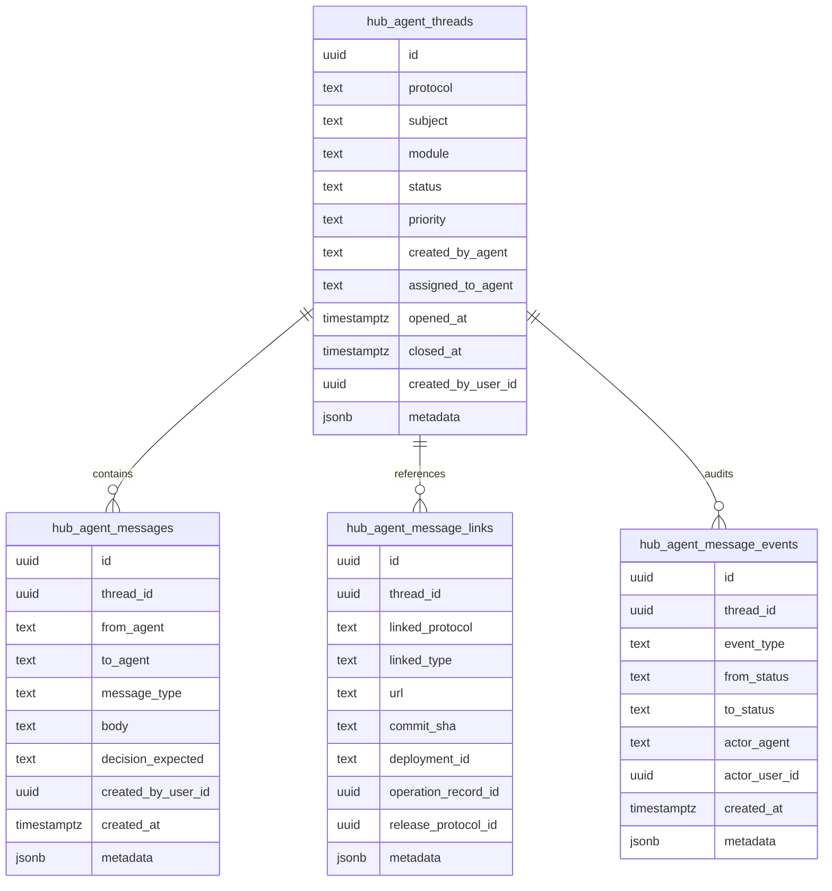

# Panteon - Agent Messaging V1 Design

Status: `DESENHO REVERSIVEL / NAO APLICAR SEM AUTORIZACAO`
Owner: `Zeus`
Fonte base: `docs/operations/panteon-agent-communication-protocol.md`
Data: `2026-05-23`

Este documento detalha a proposta V1 para transformar a comunicacao entre
agentes em threads rastreaveis. Ele e um desenho tecnico para revisao, nao uma
migration pronta para aplicar.

## Objetivo

Criar uma camada operacional para que Zeus, Hefesto e agentes de modulo possam
registrar handoffs, bloqueios, duvidas, incidentes e validacoes com protocolo
proprio `AG-*`, sem depender apenas de Markdown, chat antigo ou memoria local.

## Escopo incluido

- Threads entre agentes com status, prioridade, modulo, origem e destino.
- Mensagens estruturadas dentro de cada thread.
- Links para protocolos existentes, registros do Operations Center, releases,
  commits, deployments e documentos.
- Eventos de auditoria para mudancas de status.
- API server-side proposta para criacao de mensagens.
- Leitura futura pela aba `Agentes` do Zeus.

## Fora do escopo

- Migration aplicada sem autorizacao explicita do Lucas.
- Escrita em banco real sem ambiente e permissao definidos.
- Deploy, Vercel, Supabase, envs, secrets, dominios, aliases ou producao.
- Automacao de acoes sensiveis.
- Envio externo via Iris, e-mail, WhatsApp, Meta ou webhook real.
- Realtime obrigatorio na primeira versao.

## Modelo conceitual



## Tabelas propostas

### `hub_agent_threads`

Representa a conversa operacional principal.

Campos:

- `id`: uuid primario.
- `protocol`: protocolo humano no formato `AG-000001`.
- `subject`: titulo curto, pesquisavel e operacional.
- `module`: modulo ou squad afetado, como `Zeus`, `Hefesto`, `Iris`.
- `status`: estado atual da thread.
- `priority`: prioridade operacional.
- `created_by_agent`: agente que abriu a thread.
- `assigned_to_agent`: agente responsavel pela proxima acao.
- `opened_at`: data de abertura.
- `closed_at`: data de encerramento, quando houver.
- `created_by_user_id`: usuario humano associado, quando aplicavel.
- `metadata`: metadados sem valores sensiveis.

Indices futuros recomendados:

- `protocol` unico.
- `status`, `priority`, `assigned_to_agent`.
- `module`, `opened_at`.

### `hub_agent_messages`

Representa cada mensagem dentro de uma thread.

Campos:

- `id`: uuid primario.
- `thread_id`: referencia para `hub_agent_threads`.
- `from_agent`: agente origem.
- `to_agent`: agente destino.
- `message_type`: tipo operacional da mensagem.
- `body`: corpo sanitizado.
- `decision_expected`: decisao esperada do destino.
- `created_by_user_id`: usuario humano associado, quando aplicavel.
- `created_at`: data de criacao.
- `metadata`: metadados sem payload sensivel.

### `hub_agent_message_links`

Relaciona a thread com evidencias e registros oficiais.

Campos:

- `id`: uuid primario.
- `thread_id`: referencia para `hub_agent_threads`.
- `linked_protocol`: protocolo externo ou interno, como `AT`, `CB`, `TI`,
  `OP`, `AL`, `DP`, release ou incidente.
- `linked_type`: tipo do vinculo.
- `url`: link para documento, PR, deployment ou dashboard, sem token.
- `commit_sha`: commit relacionado.
- `deployment_id`: id publico do deployment, quando permitido.
- `operation_record_id`: registro do Operations Center.
- `release_protocol_id`: registro de homologacao/producao.
- `metadata`: metadados sem secrets.

### `hub_agent_message_events`

Audita transicoes e acoes relevantes.

Campos:

- `id`: uuid primario.
- `thread_id`: referencia para `hub_agent_threads`.
- `event_type`: tipo do evento.
- `from_status`: status anterior.
- `to_status`: novo status.
- `actor_agent`: agente que executou a transicao.
- `actor_user_id`: usuario humano associado, quando aplicavel.
- `created_at`: data do evento.
- `metadata`: metadados sanitizados.

## Status permitidos

- `ABERTA`
- `EM_ANALISE`
- `AGUARDANDO_ORIGEM`
- `AGUARDANDO_DESTINO`
- `BLOQUEADA`
- `RESPONDIDA`
- `ENCAMINHADA`
- `RESOLVIDA`
- `CANCELADA`

## Tipos de mensagem

- `handoff`
- `bloqueio`
- `duvida`
- `incidente`
- `validacao`
- `pronto_para_homologacao`
- `pronto_para_producao`
- `rollback`
- `auditoria`
- `contexto`

## API proposta

Endpoint futuro:

```text
POST /api/zeus/agent-messages
```

Request proposto:

```json
{
  "threadId": null,
  "subject": "[Iris] Handoff de homologacao",
  "module": "Iris",
  "fromAgent": "Iris",
  "toAgent": "Hefesto",
  "messageType": "pronto_para_producao",
  "priority": "alta",
  "body": "Recorte homologado, validacoes anexadas e riscos conhecidos registrados.",
  "decisionExpected": "Hefesto deve comparar diario, Git e releases antes de producao.",
  "linkedProtocols": ["OP-000123"],
  "metadata": {
    "worktree": "careli-hub-worktrees/iris",
    "branch": "codex/iris/homologacao-20260523"
  }
}
```

Response proposto:

```json
{
  "thread": {
    "id": "uuid",
    "protocol": "AG-000001",
    "status": "ABERTA"
  },
  "message": {
    "id": "uuid",
    "createdAt": "2026-05-23T10:00:00.000Z"
  }
}
```

## Regras de seguranca

- Nunca salvar valor de secret, token, service role, bearer, senha,
  `POSTGRES_URL`, JWT ou connection string.
- Registrar envs apenas por nome e impacto, nunca por valor.
- Resumir payload externo; nao persistir payload bruto de API sensivel.
- Threads envolvendo banco, Supabase, Vercel, env, secret, alias, dominio,
  migration, rollback ou producao devem iniciar como `BLOQUEADA`.
- Escrita real depende de autorizacao explicita do Lucas, ambiente definido e
  validacao em homologacao antes de qualquer producao.
- Service role, quando existir, deve ficar apenas no server-side e nunca em
  componente client ou log.
- Logs devem registrar protocolo, status e ids, sem corpo sensivel.

## Acesso e RLS futura

Diretriz para desenho de RLS:

- Leitura para perfis operacionais autorizados no Operations Center.
- Escrita para perfis administrativos/operacionais autorizados.
- Atualizacao de status sempre gera evento em `hub_agent_message_events`.
- Usuario humano associado deve ser registrado quando houver sessao.
- Nenhuma policy deve depender de valor sensivel em metadata.

## Ordem segura de implementacao

1. Lucas revisa este desenho.
2. Zeus cria migration em arquivo, sem aplicar.
3. Zeus cria validador de payload e sanitizacao.
4. Zeus cria API local ou homologacao, sem producao.
5. Zeus testa com dados artificiais e sem secrets.
6. Lucas autoriza aplicacao em homologacao, se aprovado.
7. Aba `Agentes` passa a ler threads reais mantendo fallback V0.
8. Homologacao registra evidencias no diario e releases.
9. Producao fica com Hefesto, apenas se houver autorizacao explicita.

## Criterios de aceite

- Zeus mostra threads `AG-*` com origem, destino, modulo, status e prioridade.
- Handoffs para Hefesto apontam recorte homologado, commit/deploy e validacoes.
- Bloqueios sensiveis aparecem como `BLOQUEADA`.
- Links de evidencias funcionam sem expor token ou segredo.
- O diario canonico continua fallback se a V1 estiver indisponivel.
- Nenhum segredo aparece em banco, log, documento ou resposta de API.

## Decisao pendente

Este desenho esta pronto para revisao arquitetural, mas permanece bloqueado para
migration, banco real, API mutavel e deploy ate autorizacao explicita do Lucas.
